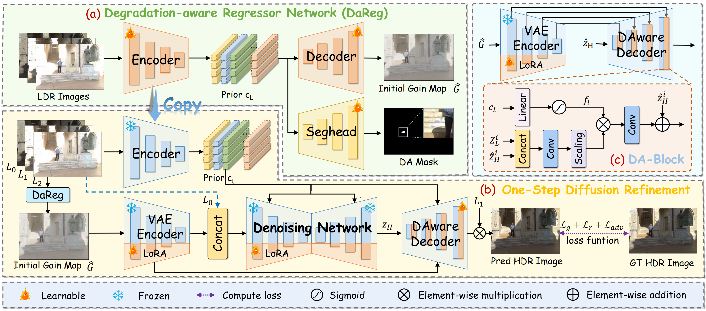

# GMODiff: One-Step Gain Map Refinement with Diffusion Priors for Efficient HDR Reconstruction

This is the implementation for GMODiff: One-Step Gain Map Refinement with Diffusion Priors for Efficient HDR Reconstruction, in ECCV, 2026. [](https://arxiv.org/abs/2512.16357)

> **Abstract:** *Pre-trained Latent Diffusion Models (LDMs) have recently shown strong perceptual priors for low-level vision tasks, making them a promising direction for multi-exposure High Dynamic Range (HDR) reconstruction. However, directly applying LDMs to HDR remains challenging due to: (1) limited dynamic-range representation caused by 8-bit latent compression, (2) high inference cost from multi-step denoising, and (3) content hallucination inherent to generative nature. 
To address these challenges, we introduce GMODiff, a gain map-driven one-step diffusion framework for multi-exposure HDR reconstruction.
Instead of reconstructing full HDR content, we reformulate HDR reconstruction as a degradation-aware Gain Map (GM) refinement problem, where the GM encodes the extended dynamic range while retaining the same bit depth as LDR images.
We initialize the denoising process from an informative regression-based estimate rather than pure noise, allowing the model to generate high-quality GMs in a single denoising step. Furthermore, recognizing that regression-based models excel in content fidelity while LDMs favor perceptual quality, we leverage regression priors to guide both the denoising process and latent decoding of the LDM, suppressing hallucinations while preserving structural accuracy.
Extensive experiments demonstrate that our GMODiff performs favorably against several state-of-the-art methods and is 100× faster than previous LDM-based methods.*

## Project Structure

```text
GMODif/
  configs/                    Dataset configuration for GMODiff
  checkpoints/                DaReg training checkpoints
  model_zoo/                  Released DaReg and GMODiff weights
  hdrvdp2_pu21                HDR-VDP2 and PU21 Evaluation Based on MATLAB
  baselines                   Primary Baseline Models
  src/dareg/                  DaReg training and inference code
  src/gmodiff/                GMODiff training, inference, and metrics code
  *.sh                        Main training, testing, and evaluation launchers
```

All GMODiff commands below are run inside `GMODif/`.

## Environment

```bash
conda create -n GMODiff python=3.10 -y
conda activate GMODiff
pip install --upgrade pip
pip install -r requirements.txt
```

Stage-3 uses Stable Diffusion 2.1:

```text
stabilityai/stable-diffusion-2-1-base
```

Make sure this model can be downloaded or is already cached before running GMODiff training or inference.

## Quick Start

### 1. Prepare Checkpoints
Download the released weights from [Baidu Netdisk](https://pan.baidu.com/s/1qY0_HG5ALpNROGNX8nbcMQ?pwd=chgh) and place them as follows:
```text
GMODif/model_zoo/dareg_mask.pth
GMODif/model_zoo/gmodiff.pkl
```
### 2. Prepare Data
Download the prepared [test set](https://pan.baidu.com/s/1HCbIJ2xZhpCSVJ_ZYPwrcg?pwd=tv75) and place it under:
```text
GMODiff/data/Test
```
### 3. Run Inference
```bash
cd GMODif
bash test_gmodiff.sh
bash evaluate_stage3_metrics.sh
```

Outputs are saved to the `--output_dir` set in `test_gmodiff.sh`.
[HDR-VDP-2.2](https://hdrvdp.sourceforge.net/wiki/) and [PU21 metrics](https://github.com/gfxdisp/pu21) require MATLAB for computation. The corresponding evaluation code is provided in `GMODiff/hdrvdp2_pu21`.


## Getting the Data

### 1. The datasets we used are as follows:

- [Kalantari's dataset](https://cseweb.ucsd.edu/~viscomp/projects/SIG17HDR/)
- [Tel's dataset](https://drive.google.com/drive/folders/1CtvUxgFRkS56do_Hea2QC7ztzglGfrlB)
- [Challenge123 dataset](https://huggingface.co/datasets/ltkong218/Challenge123)
- [Prabhakar's dataset](https://val.cds.iisc.ac.in/HDR/ICCP19/)

The first three datasets are used for training and in-distribution testing. Prabhakar's dataset is used for out-of-distribution testing.


DaReg and GMODiff expect each scene to contain three LDR images, one exposure file, and one HDR image. File names can differ across datasets, but the loader should be given folders with this structure:

```text
data/
  Training/
    scene_xxx/
      input_1.tif
      input_2.tif
      input_3.tif
      exposure.txt
      HDRImg.hdr
  Test/
    scene_xxx/
      input_1.tif
      input_2.tif
      input_3.tif
      exposure.txt
      HDRImg.hdr
```


### 2. Preparing Cropped Training Data for DaReg

Stage-1 and stage-2 DaReg training use cropped training patches. You can generate them with `gen_crop_data.py` from [HDR-Transformer](https://github.com/liuzhen03/HDR-Transformer-PyTorch):

```bash
python gen_crop_data.py
```

You may either merge multiple datasets into one crop folder or generate separate crop folders. The DaReg dataloader accepts a list of crop folders through `--sub_set`.


## Path Configuration

### 1. DaReg Training Paths

Edit:

```text
GMODif/train_stage1_dareg.sh
GMODif/train_stage2_dareg_mask.sh
```

The scripts contain:

```bash
--dataset_dir ../../data/sig17
--sub_set ../../data/sig17_training_crop256_stride128
```

Meaning:

- `--dataset_dir` points to the full dataset folder used for validation. It should contain `Training/` and `Test/`.
- `--sub_set` points to cropped training patch folders generated by `gen_crop_data.py`.

If you have multiple cropped training folders, write them one after another:

```bash
--sub_set ../../data/kal_crop ../../data/tel_crop ../../data/challenge123_crop
```

### 2. GMODiff Training Paths

Edit:

```text
GMODif/configs/gmodiff.json
```
Replace them with your actual paths. For example, to train on several datasets and test on Kalantari's test split:

```json
"train": {
  "dataroot_H": [
    "../../data/Kal/Training",
    "../../data/Tel/Training",
    "../../data/Challenge123/Training"
  ]
}
```


### 3. GMODiff Inference Paths

The test data path is controlled by `test.dataroot_H` in `configs/gmodiff.json`:

```json
"test": {
  "dataroot_H": [
    "../../data/Kal/Test/Test-set"
  ]
}
```

## Training

GMODiff uses a three-stage training workflow.

### Stage 1: Train DaReg Gain-Map Regressor

```bash
cd GMODif
bash train_stage1_dareg.sh
```

### Stage 2: Train DaReg Mask Head

```bash
cd GMODif
bash train_stage2_dareg_mask.sh
```

### Stage 3: Train GMODiff

```bash
cd GMODif
bash train_stage3_gmodiff.sh
```

## Baseline Models

Since we retrain the compared methods on our collected multi-exposure HDR reconstruction dataset, we provide pretrained weights for several competitive DNN-based baselines. The corresponding inference code is available in the `baselines/` folder and can be used to reproduce the baseline results.

The pretrained baseline weights can be downloaded from [Baidu Netdisk](https://pan.baidu.com/s/1YODpg_vxe269WqZpP3a0gQ?pwd=58fx).
## Notes

- Stage-3 uses Stable Diffusion 2.1 `stabilityai/stable-diffusion-2-1-base` as the pretrained LDM backbone. Since the original Hugging Face repository no longer provides the model weights, `Manojb/stable-diffusion-2-1-base` can be used as an alternative.
- `MANIQA` may use different pretrained weights across `PyIQA` versions, and its scores can fluctuate even for identical input images. To ensure a fair comparison, all experiments are conducted with the same random seed.
- We include the GAN loss following [CODiff](https://github.com/IGITUGraz/WeatherDiffusion](https://github.com/jp-guo/CODiff?tab=readme-ov-file)). The released implementation forwards the denoising encoder under `torch.no_grad()` during this loss computation, which blocks gradients through this branch. To avoid ambiguity and reduce training overhead, this loss is disabled by default in this repository.

## Acknowledgement
Our work is inspired by the following works and uses parts of their official implementations:
* [GM-Diffusion](https://github.com/Guanys-dar/GM-Diffusion)
* [CODiff](https://github.com/jp-guo/CODiff)
* [img2img-turbo](https://github.com/GaParmar/img2img-turbo)
* [HDR-Transformer](https://github.com/liuzhen03/HDR-Transformer-PyTorch)

Thanks to their great work!


## Citation

If this code is useful for your research, please cite:

```bibtex
@inproceedings{hu2026gmodiff,
  title={GMODiff: One-Step Gain Map Refinement with Diffusion Priors for HDR Reconstruction},
  author={Hu, Tao and Zhou, Weiyu and Tu, Yanjie and Wu, Peng and Dong, Wei and Yan, Qingsen and Zhang, Yanning},
  booktitle={European Conference on Computer Vision},
  year={2026},
  organization={Springer}
}
```
